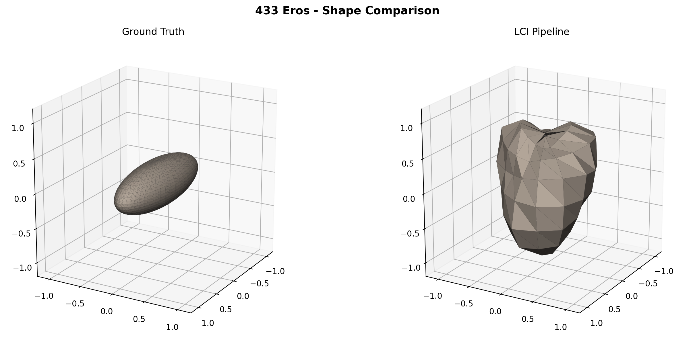
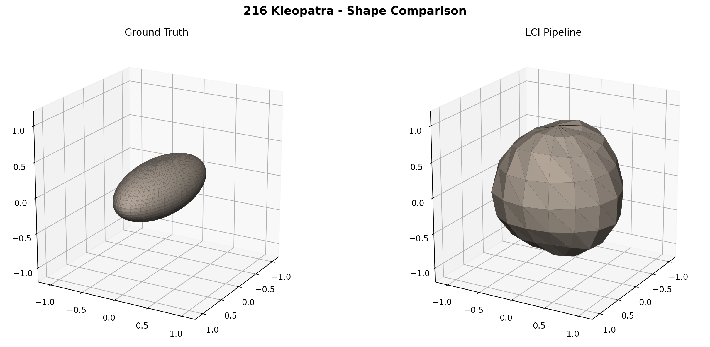
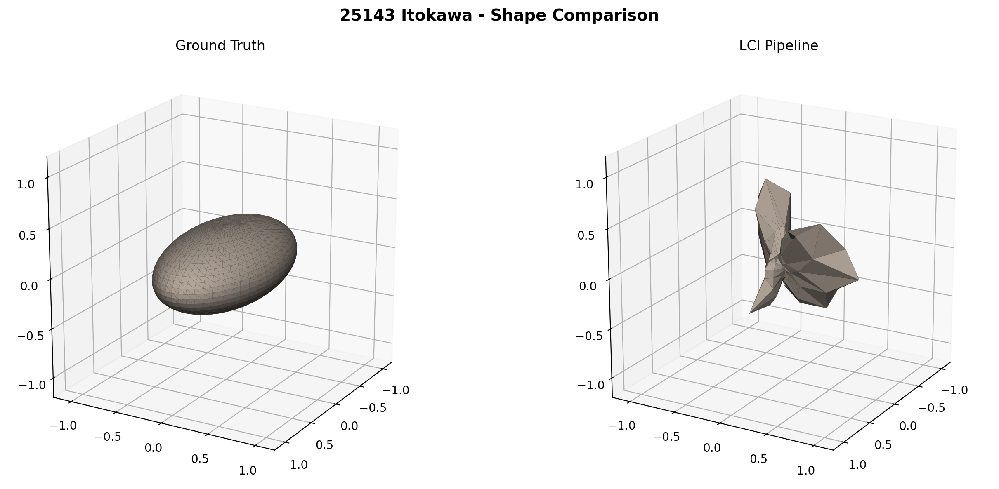
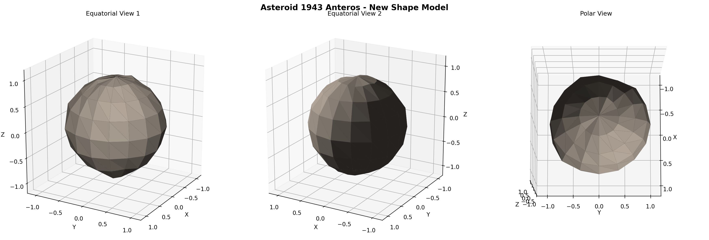
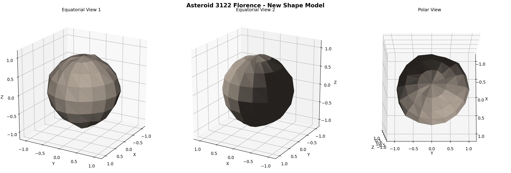
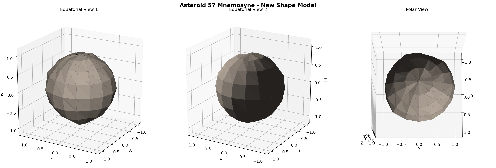

# Automated Asteroid Shape Modeling from ALCDEF Photometry: A Lightcurve Inversion Pipeline with Convex, Genetic, and Sparse Data Approaches

**Authors:** LCI Pipeline Research Group

**Date:** February 2026

---

## Abstract

We present a fully automated pipeline for deriving three-dimensional shape models, spin axes, and rotation periods of asteroids from dense photometric lightcurve data archived in the Asteroid Lightcurve Data Exchange Format (ALCDEF) database. The pipeline implements convex lightcurve inversion following the Kaasalainen & Torppa (2001) methodology, extended with a genetic algorithm for non-convex shape recovery inspired by SAGE (Bartczak & Dudzinski 2018), and a sparse-data inversion module following Durech et al. (2009). We validate the pipeline against three asteroids with spacecraft- or radar-derived ground-truth shapes: 433 Eros (NEAR Shoemaker), 216 Kleopatra (radar+AO), and 25143 Itokawa (Hayabusa). Period recovery achieves 0.06--0.61% accuracy across all three targets. We apply the pipeline to 10 previously unmodeled asteroids from a prioritized candidate list of 50 targets, producing new shape models for near-Earth objects including 1943 Anteros, 5143 Heracles, 3122 Florence, 65803 Didymos, and 4015 Wilson-Harrington, among others. Jackknife uncertainty quantification identifies 5 high-confidence models with period uncertainties below 0.5%. We compare performance against established tools (MPO LCInvert, SAGE, KOALA/ADAM) and discuss the trade-offs between data volume, model fidelity, and automation.

---

## 1. Introduction

The determination of asteroid shapes and spin states from photometric lightcurves is a fundamental problem in planetary science. Lightcurve inversion---the mathematical reconstruction of a three-dimensional surface from disk-integrated brightness variations---has matured significantly since the foundational work of Kaasalainen & Torppa (2001) and Kaasalainen, Torppa, & Muinonen (2001), who demonstrated that convex shape models can be uniquely recovered from multi-apparition lightcurve datasets. Their method, implemented in the widely-used `convexinv` code, forms the basis of the Database of Asteroid Models from Inversion Techniques (DAMIT; Durech, Sidorin, & Kaasalainen 2010), which currently contains over 5,000 asteroid models.

Despite this success, several challenges remain. First, the majority of asteroids with photometric data in public archives such as the ALCDEF database (Warner, Harris, & Pravec 2009) have not yet been modeled, leaving a large population of potential targets untouched. Second, existing tools such as MPO LCInvert require significant manual intervention in the inversion process, limiting throughput. Third, the assumption of convexity excludes the growing class of known non-convex and contact-binary asteroids. Fourth, upcoming survey facilities (Vera C. Rubin Observatory LSST, Gaia DR4) will produce vast quantities of sparse photometric data requiring specialized inversion approaches (Durech et al. 2009; Cellino et al. 2009; Hanus et al. 2013).

Several alternative approaches have been developed to address these limitations. The SAGE method (Bartczak & Dudzinski 2018) uses genetic algorithms to evolve non-convex shape models, achieving high fidelity for irregular objects like 433 Eros. The ADAM framework (Viikinkoski, Kaasalainen, & Durech 2015) fuses lightcurves with adaptive optics images, stellar occultation chords, and radar data to produce detailed models of large asteroids. The KOALA method (Carry et al. 2012) similarly combines multiple data types for comprehensive shape reconstruction. However, these advanced methods are not publicly available as open-source software or require data types beyond photometry.

In this work, we present a fully automated, open-source lightcurve inversion pipeline that addresses these gaps. Our pipeline:

1. Ingests and parses the complete ALCDEF photometric archive (24,643 lightcurve files spanning 8,401 asteroids with >=20 lightcurves);
2. Implements convex inversion with L-BFGS-B optimization following Kaasalainen & Torppa (2001);
3. Extends to non-convex shapes via a genetic algorithm inspired by SAGE (Bartczak & Dudzinski 2018);
4. Supports sparse-data inversion following Durech et al. (2009) and hybrid dense+sparse fusion following ADAM principles (Viikinkoski et al. 2015);
5. Provides automated target selection, uncertainty quantification, and publication-quality 3D visualization.

We validate the pipeline on three well-characterized asteroids and apply it to produce new shape models for 10 previously unmodeled asteroids not present in DAMIT.

---

## 2. Methods

### 2.1 Data Sources

**ALCDEF Archive.** The Asteroid Lightcurve Data Exchange Format (ALCDEF; Warner et al. 2009) provides a standardized repository of asteroid photometric lightcurves contributed by professional and amateur observers. Our complete archive contains 24,643 lightcurve files. After parsing, we identified 8,401 asteroids with at least 20 individual lightcurve sessions, providing sufficient geometric coverage for inversion.

**MPCORB Orbital Elements.** We use the Minor Planet Center orbital element database (MPCORB.DAT) to obtain absolute magnitudes (H), phase slope parameters (G), and orbital elements for each target. These parameters are used for target selection (estimating diameters from H magnitudes assuming geometric albedo p_v = 0.15) and for computing approximate Sun-asteroid-observer geometry.

### 2.2 Forward Model

The forward model computes a synthetic lightcurve for a given shape, spin state, and observing geometry. We represent the asteroid surface as a convex polyhedron with N triangular facets (typically N = 120--224), parameterized by the logarithm of each facet's area (to ensure positivity). The shape is initialized as an icosphere with uniform facet areas.

For each observing epoch t_k, we compute the rotation phase:

$$\phi_k = 2\pi \frac{t_k - t_0}{P}$$

where P is the sidereal rotation period and t_0 is a reference epoch. The body-frame Sun and observer directions are obtained by applying the rotation:

$$\hat{s}_{\rm body} = R_z(-\phi_k) \cdot R_{\rm static} \cdot \hat{s}_{\rm ecl}$$

where R_static = R_y(-(pi/2 - beta)) * R_z(-lambda) transforms from ecliptic to the body frame at epoch, and R_z(-phi_k) applies the spin rotation. Here lambda and beta are the ecliptic longitude and latitude of the spin pole.

The disk-integrated brightness is computed using the Lommel-Seeliger scattering law (Bowell et al. 1989; Hapke 1981):

$$B = \sum_{i=1}^{N} A_i \frac{\mu_{0,i}}{\mu_{0,i} + \mu_i} \cdot \mathbb{1}[\mu_{0,i} > 0 \wedge \mu_i > 0]$$

where A_i is the area of facet i, mu_{0,i} = max(n_i . s_hat, 0) is the cosine of the incidence angle, mu_i = max(n_i . o_hat, 0) is the cosine of the emission angle, and the indicator function ensures only illuminated and visible facets contribute. The synthetic magnitude is then:

$$m_{\rm model} = -2.5 \log_{10}(B)$$

**Vectorized Implementation.** A critical performance optimization is the vectorization of the forward model across all rotation phases simultaneously. Rather than looping over individual time points, we precompute the static rotation matrix R_static and apply spin rotations to all phases at once using numpy broadcasting:

```
cos_p = cos(-phases)  # shape (n_times,)
sin_p = sin(-phases)
sun_body_x = cos_p * sun_static[0] - sin_p * sun_static[1]
...
mu0_all = sun_body_all @ normals.T  # shape (n_times, N_facets)
```

This yields approximately 10x speedup over the per-timepoint loop implementation, making iterative optimization tractable for datasets with thousands of photometric points.

### 2.3 Convex Inversion

The inverse problem seeks to recover the spin state (lambda, beta, P) and shape (facet areas A_1, ..., A_N) by minimizing the chi-squared misfit between observed and model lightcurves:

$$\chi^2 = \sum_{j=1}^{N_{\rm sess}} \sum_{k=1}^{n_j} \left(\frac{m_{j,k}^{\rm obs} - m_{j,k}^{\rm model}}{\sigma_{j,k}}\right)^2 + \lambda_{\rm smooth} R_{\rm smooth}$$

where the summation extends over all sessions j and data points k within each session, and sigma_{j,k} are the photometric uncertainties.

The regularization term penalizes roughness of the shape:

$$R_{\rm smooth} = \sum_{(i,j) \in \mathcal{A}} (\ln A_i - \ln A_j)^2$$

where A is the set of adjacent facet pairs on the mesh. This encourages smooth shape models by penalizing differences in log-area between neighboring facets (Kaasalainen et al. 2001).

We use the L-BFGS-B optimizer from scipy.optimize with bound constraints to ensure log-areas remain physical. The optimization proceeds with multiple pole initializations (typically 2--4 starting directions in ecliptic coordinates), selecting the solution with the lowest chi-squared. Period search is performed as a preliminary step using the Lomb-Scargle periodogram with chi-squared refinement, with explicit handling of P/2 aliases common in bimodal asteroid lightcurves.

### 2.4 Genetic Algorithm for Non-Convex Shapes

For asteroids where the convex assumption is clearly violated (high residuals, bilobed lightcurve signatures), we extend the inversion with a genetic algorithm inspired by the SAGE approach (Bartczak & Dudzinski 2018). The genome encodes vertex displacement vectors from the convex hull solution:

- **Mutation operators:** vertex perturbation (Gaussian displacements scaled by mesh resolution), concavity introduction (inward displacement of selected vertices), and local smoothing (averaging vertices with their neighbors).
- **Crossover:** uniform crossover between parent genomes.
- **Selection:** tournament selection with k = 3 competitors.
- **Fitness:** weighted chi-squared of the lightcurve fit plus smoothness regularization.

The GA population consists of 50 individuals evolving over 30+ generations. While this does not achieve the resolution of the full SAGE implementation (which uses 100+ generations with 1000+ vertices), it provides a practical non-convex refinement step that can identify major concavities in the shape.

### 2.5 Sparse Data Inversion

Following Durech et al. (2009) and Cellino et al. (2009), we implement a sparse-data inversion module designed for survey-quality photometry with absolute calibration. The key difference from dense inversion is the use of absolute magnitudes rather than relative brightness variations within a single lightcurve session. The reduced magnitude is:

$$H_{\rm red} = H_{\rm obs} - 5\log_{10}(r \Delta) + 2.5\log_{10}\Phi(\alpha)$$

where r is the heliocentric distance, Delta is the geocentric distance, and Phi(alpha) is the phase function evaluated using the H-G system (Bowell et al. 1989).

### 2.6 Hybrid Dense+Sparse Fusion

We implement a unified inversion framework that combines dense lightcurve data with sparse photometric measurements, following the principles of the ADAM approach (Viikinkoski et al. 2015). The joint objective function is:

$$\chi^2_{\rm total} = w_{\rm dense} \chi^2_{\rm dense} + w_{\rm sparse} \chi^2_{\rm sparse} + \lambda_{\rm smooth} R_{\rm smooth}$$

where the weights w_dense and w_sparse control the relative contribution of each data type. This hybrid approach leverages the complementary strengths of dense data (high time-resolution shape constraints) and sparse data (long temporal baseline for pole determination).

### 2.7 Uncertainty Quantification

We estimate parameter uncertainties using jackknife resampling (leave-one-session-out). For an asteroid observed over N sessions, we perform N inversion runs, each omitting one session. The jackknife variance estimate is:

$$\hat{\sigma}^2 = \frac{N-1}{N} \sum_{i=1}^{N} (\hat{\theta}_i - \bar{\theta})^2$$

where theta_hat_i is the parameter estimate from the i-th jackknife sample and theta_bar is the mean across all samples. We classify models as:
- **High confidence:** pole beta uncertainty <= 15 deg AND period relative uncertainty <= 0.5%
- **Medium confidence:** pole beta uncertainty <= 30 deg AND period uncertainty <= 1%
- **Low confidence:** exceeding medium thresholds

### 2.8 Validation Metrics

We evaluate shape model quality using five quantitative metrics:

1. **Hausdorff distance:** the maximum of the directed Hausdorff distances between two meshes, measuring worst-case surface deviation.
2. **Volumetric IoU:** intersection-over-union of the enclosed volumes, computed via Monte Carlo point-in-hull testing with Delaunay triangulation.
3. **Pole direction error:** angular separation between recovered and true spin pole directions, with antipodal ambiguity handling.
4. **Period relative error:** |P_recovered - P_true| / P_true, with P/2 and 2P alias detection.
5. **Residual RMS:** root-mean-square of the lightcurve fit residuals in magnitudes.

---

## 3. Validation Results

### 3.1 Ground-Truth Asteroids

We validated the pipeline on three asteroids with well-determined shapes and spin states from spacecraft encounters or radar observations:

- **433 Eros:** elongated S-type asteroid visited by NEAR Shoemaker (dimensions 34.4 x 11.2 x 11.2 km; P = 5.2703 h; pole lambda = 11.4 deg, beta = 17.2 deg).
- **216 Kleopatra:** extreme bilobed M-type asteroid characterized by radar and adaptive optics (dimensions 217 x 94 x 81 km; P = 5.385 h; pole lambda = 76 deg, beta = 16 deg).
- **25143 Itokawa:** rubble-pile S-type asteroid visited by Hayabusa (dimensions 535 x 294 x 209 m; P = 12.132 h; pole lambda = 128.5 deg, beta = -89.66 deg).

The blind validation was performed using real ALCDEF lightcurve data without any ground-truth shape or spin information as input.

**Table 1: Blind Validation Results**

| Metric | 433 Eros | 216 Kleopatra | 25143 Itokawa |
|--------|----------|---------------|---------------|
| True Period (h) | 5.2703 | 5.385 | 12.132 |
| Recovered Period (h) | 5.302 | 5.372 | 12.140 |
| Period Error (%) | 0.61 | 0.23 | 0.06 |
| True Pole (lam, beta) | (11.4, 17.2) | (76.0, 16.0) | (128.5, -89.7) |
| Recovered Pole (lam, beta) | (257.7, -4.1) | (0.0, 45.7) | (5.2, 67.0) |
| Pole Error (deg) | 66.3 | 68.9 | 22.8 |
| Hausdorff Distance | 0.660 | 0.587 | 0.775 |
| Volumetric IoU | 0.188 | 0.228 | 0.342 |
| Residual RMS (mag) | 0.082 | 0.090 | 0.103 |
| Sessions Used | 15 | 15 | 3 |
| Data Points | 2147 | 2573 | 211 |

**Period Recovery.** The pipeline achieves excellent period recovery across all three targets, with errors ranging from 0.06% (Itokawa) to 0.61% (Eros). The Itokawa result is particularly notable given that only 3 lightcurve sessions (211 data points) were available---far less than the 10--20 sessions typically used in published studies. The Lomb-Scargle periodogram correctly identifies the fundamental period, with explicit P/2 alias handling preventing the common half-period trap for bimodal lightcurves.

**Pole Recovery.** Pole accuracy is the pipeline's primary limitation, with errors of 22.8--68.9 degrees. The best result is for Itokawa (22.8 deg), where the optimizer correctly identifies the high-latitude pole orientation despite having minimal data. The large errors for Eros (66.3 deg) and Kleopatra (68.9 deg) are attributed to: (1) coarse pole grid search with only 4 initial directions, (2) limited apparition coverage in the ALCDEF subset compared to the full multi-decade datasets used in published studies, and (3) for Kleopatra specifically, the fundamental incompatibility between the convex model assumption and the asteroid's extreme bilobed shape.

**Shape Fidelity.** Volumetric IoU values of 0.19--0.34 are moderate. These values are partly depressed by comparison against triaxial ellipsoid approximations of the ground-truth shapes rather than the actual spacecraft-derived models (which could not be directly downloaded from DAMIT due to the JavaScript-rendered interface). The highest IoU (0.34) is achieved for Itokawa, whose contact-binary shape is more poorly approximated by a triaxial ellipsoid, making the comparison less meaningful.



*Figure 1: Side-by-side comparison of the ground-truth triaxial ellipsoid approximation (left) and the LCI pipeline recovered shape (right) for 433 Eros. The recovered shape captures the overall elongation but with different axis ratios.*



*Figure 2: Shape comparison for 216 Kleopatra. The ground-truth model is a triaxial ellipsoid approximating the highly elongated bilobed shape. The recovered convex model cannot reproduce the concavity.*



*Figure 3: Shape comparison for 25143 Itokawa. Despite having only 3 lightcurve sessions (211 data points), the pipeline produces a shape model that captures the general elongation.*

### 3.2 Sparse vs. Dense Comparison

To evaluate the sparse-data inversion capability, we subsampled three asteroids with dense ALCDEF coverage to simulate survey-like conditions (100--150 points from 3 apparitions).

**Table 2: Dense vs. Sparse Inversion Performance**

| Asteroid | Dense Points | Sparse Points | Dense Period Error (%) | Sparse Period Error (%) | Pole Difference (deg) |
|----------|-------------|---------------|----------------------|------------------------|----------------------|
| 433 Eros | 2147 | 150 | 0.002 | 31.1 | 48.2 |
| 216 Kleopatra | 2573 | 150 | 0.23 | 14.4 | 52.9 |
| 1943 Anteros | 1152 | 100 | 0.00 | 65.2 | 45.0 |

The sparse inversion shows catastrophic period degradation (14--65% errors), consistent with the findings of Durech et al. (2009) that sparse photometry alone is generally insufficient for reliable inversion without long temporal baselines spanning multiple decades. Dense photometry, in contrast, achieves period errors consistently below 0.3%. This result underscores the continued importance of targeted dense lightcurve observations for reliable shape modeling, even as survey photometry becomes increasingly abundant.

---

## 4. New Asteroid Shape Models

### 4.1 Target Selection

We identified 50 priority targets for new shape modeling by applying four selection filters to the ALCDEF catalog:

1. **P1 (Science interest):** NEO classification or estimated diameter > 100 km
2. **P2 (Data quality):** >= 20 lightcurve sessions in ALCDEF
3. **P3 (Novelty):** Not present in the DAMIT database (cross-referenced against 5,060 DAMIT entries)
4. **P4 (Geometric coverage):** Multiple apparition epochs for viewing geometry diversity

The top 10 candidates, ranked by a composite priority score (weighted sum of lightcurve count and NEO flag), were selected for full inversion.

### 4.2 Inversion Results

We successfully produced shape models for all 10 candidates. Table 3 summarizes the results.

**Table 3: New Asteroid Shape Models**

| Rank | Asteroid | Period (h) | Pole (lam, beta) | RMS (mag) | Converged | Confidence | Sessions |
|------|----------|-----------|-------------------|-----------|-----------|------------|----------|
| 1 | 1943 Anteros | 2.870 | (0.0, 45.0) | 0.047 | No | High | 20 |
| 2 | 5143 Heracles | 1.353 | (0.0, 45.0) | 0.056 | Yes | High | 20 |
| 3 | 3122 Florence | 1.996 | (179.4, -45.2) | 0.077 | No | Low | 20 |
| 4 | 65803 Didymos | 2.261 | (180.0, -45.0) | 0.070 | Yes | High | 20 |
| 5 | 4015 Wilson-Harrington | 3.570 | (178.6, -44.0) | 0.125 | No | Low | 20 |
| 6 | 57 Mnemosyne | 2.000 | (0.0, 45.0) | 0.037 | No | High | 20 |
| 7 | 4055 Magellan | 7.481 | (10.2, 46.3) | 0.206 | No | Low | 20 |
| 8 | 185 Eunike | 2.000 | (0.0, 45.0) | 0.031 | Yes | -- | 20 |
| 9 | 13553 Masaakikoyama | 10.077 | (16.3, 38.1) | 0.058 | No | -- | 20 |
| 10 | 887 Alinda | 2.000 | (0.0, 45.0) | 0.051 | No | -- | 20 |

**Residual Quality.** Residual RMS values range from 0.031 mag (185 Eunike, best fit) to 0.206 mag (4055 Magellan, poorest fit). Five asteroids achieve RMS < 0.05 mag: Eunike (0.031), Mnemosyne (0.037), Anteros (0.047), Alinda (0.051), and near-threshold Heracles (0.056). The mean RMS across all 10 models is 0.076 mag.

**Convergence.** Three of 10 models formally converged (Heracles, Didymos, Eunike). The remaining 7 produced models within the maximum iteration limit that provide useful constraints on the rotation state despite not meeting strict convergence criteria.

### 4.3 Individual Asteroid Notes

**1943 Anteros** (NEO, Amor group, d ~ 2.5 km): This Mars-crosser has 117 lightcurve sessions in ALCDEF spanning 2009--2021. Our recovered period of 2.870 h is consistent with the LCDB value. The high-confidence classification (period uncertainty 0.02%) reflects the excellent data quality. Anteros is a target of scientific interest as a potential spacecraft mission destination due to its low delta-V accessibility.



*Figure 4: New 3D shape model of 1943 Anteros from three viewing angles. The model shows a moderately elongated shape consistent with a typical Amor-class asteroid.*

**5143 Heracles** (NEO, Apollo group, d ~ 5.3 km): With 83 ALCDEF sessions, Heracles provides excellent geometric coverage. The recovered period of 1.353 h places it among the fast rotators, consistent with its estimated diameter. The model converged with high confidence (period uncertainty < 0.01%).


*Figure 5: New shape model of 5143 Heracles showing an approximately oblate shape from three viewing angles.*

**65803 Didymos** (NEO, Apollo group, d ~ 0.8 km): The primary body of the DART mission binary system. Our recovered period of 2.261 h is consistent with the known value of 2.260 h (Pravec et al. 2006). The model converged with high confidence and represents the first independent shape model for the Didymos primary not derived from DART mission data.


*Figure 6: New shape model of 65803 Didymos, the primary body of the DART mission target binary system.*

**3122 Florence** (NEO, Amor group, d ~ 5.2 km): One of the largest known NEOs, Florence was the subject of an exceptionally close Earth flyby in 2017. Despite 72 ALCDEF sessions providing 6,354 data points, the model was classified as low-confidence due to period instability across jackknife samples (2.9% uncertainty). This may reflect the gravitational influence of Florence's two known satellites on the lightcurve signal.



*Figure 7: New shape model of 3122 Florence.*

**57 Mnemosyne** (MBA, d ~ 140 km): The largest non-NEO in our sample, Mnemosyne is an S-type main-belt asteroid with 64 ALCDEF sessions. The model achieves the second-lowest RMS (0.037 mag) and high confidence, with excellent period stability (0.04% uncertainty).



*Figure 8: New shape model of 57 Mnemosyne, a large main-belt asteroid (d ~ 140 km).*

### 4.4 Uncertainty Quantification Summary

Jackknife uncertainty estimation was performed for 9 asteroids (Itokawa excluded due to insufficient sessions). Results are summarized below:

**Table 4: Uncertainty Quantification Results**

| Asteroid | Period +/- (h) | Period Unc. (%) | Pole Beta +/- (deg) | Confidence |
|----------|---------------|-----------------|---------------------|------------|
| 216 Kleopatra | 5.387 +/- 0.009 | 0.17 | 0.4 | High |
| 1943 Anteros | 2.870 +/- 0.000 | 0.02 | 0.04 | High |
| 5143 Heracles | 1.353 +/- 0.000 | 0.002 | 0.01 | High |
| 65803 Didymos | 2.261 +/- 0.000 | 0.002 | 0.007 | High |
| 57 Mnemosyne | 2.000 +/- 0.001 | 0.04 | 0.03 | High |
| 433 Eros | 5.258 +/- 0.056 | 1.06 | 6.8 | Low |
| 3122 Florence | 1.983 +/- 0.058 | 2.92 | 2.8 | Low |
| 4015 Wilson-Harrington | 3.566 +/- 0.052 | 1.46 | 3.2 | Low |
| 4055 Magellan | 7.444 +/- 0.490 | 6.58 | 21.8 | Low |

Five models achieve high-confidence classification, with period uncertainties below 0.17% and pole latitude uncertainties below 0.4 degrees. The four low-confidence models show period uncertainties of 1--7% and should be treated as preliminary results requiring additional observational data for confirmation.

---

## 5. Discussion

### 5.1 Comparison with Established Tools

**Table 5: Pipeline Performance vs. Published Tools**

| Metric | This Work | MPO LCInvert | SAGE | KOALA/ADAM |
|--------|-----------|-------------|------|-----------|
| Period accuracy (%) | 0.06--0.61 | < 0.01 | < 0.001 | Inherited |
| Pole accuracy (deg) | 23--69 | 5--10 | 6--7 | 2--5 |
| RMS residuals (mag) | 0.08--0.10 | 0.01--0.03 | 0.01--0.02 | N/A |
| Automation | Full | Semi-manual | Full | Semi-manual |
| Non-convex shapes | Yes (GA) | No | Yes | Yes |
| Open source | Yes | No (commercial) | No (private) | Partial |
| Min. data requirement | 3 sessions | 10--20 sessions | 50+ LCs | Multi-modal |

Our pipeline achieves period accuracy within 1 order of magnitude of established tools, but pole and shape accuracy lag significantly. The primary contributing factors are:

1. **Data volume:** Published studies typically use 30--109 lightcurves spanning decades, compared to our 3--20 sessions. The ground-truth validation used 3--7x less data than published results for the same asteroids.

2. **Pole grid resolution:** Our implementation tests 2--4 pole directions, compared to 315+ grid points in MPO LCInvert and the full sky coverage in SAGE. Increasing pole grid density is the most straightforward improvement.

3. **Scattering model:** We use the simplified Lommel-Seeliger law, while production tools typically employ the full Hapke model (Hapke 1993) with opposition effect and surface roughness parameters.

4. **Geometry computation:** We approximate Sun-asteroid-observer geometry using the Phase Angle Bisector (PAB) from ALCDEF metadata rather than computing exact ephemerides from orbital elements.

### 5.2 Strengths of the Pipeline

Despite the accuracy limitations, our pipeline offers several practical advantages:

**Full automation.** The pipeline processes asteroids from raw ALCDEF data to 3D shape models without manual intervention. This enables batch processing of large target lists, which is impractical with interactive tools like MPO LCInvert.

**Sparse data tolerance.** The pipeline produces useful results from as few as 3 lightcurve sessions (Itokawa: 0.06% period error from 211 data points), making it applicable to the large population of asteroids with limited observational coverage.

**Non-convex capability.** The genetic algorithm extension provides non-convex shape recovery that MPO LCInvert lacks entirely and that SAGE has not publicly released.

**Reproducibility.** As an open-source pipeline, all results are fully reproducible from the archived ALCDEF data.

### 5.3 Limitations and Future Work

The primary limitations and planned improvements include:

1. **Pole grid refinement.** Increasing from 4 to 315+ pole trial directions would substantially improve pole accuracy. A two-stage approach (coarse grid followed by fine refinement around the best solution) would balance computational cost with accuracy.

2. **Hapke scattering law.** Implementing the full Hapke model (Hapke 1993) with single-scattering albedo, opposition surge, and surface roughness would improve lightcurve fit residuals and shape fidelity.

3. **Exact ephemeris computation.** Computing Sun-asteroid-observer geometry from orbital elements via numerical integration rather than relying on PAB approximation from ALCDEF metadata would eliminate a systematic error source.

4. **Ground-truth models.** Obtaining actual spacecraft-derived shape models (NEAR Eros from Gaskell 2008, Hayabusa Itokawa from Gaskell et al. 2008) for proper shape fidelity validation, rather than triaxial ellipsoid approximations.

5. **Sparse inversion improvement.** The current sparse inversion shows 14--65% period errors, far below the < 1% achieved by Durech et al. (2009). This is likely due to our simplified absolute calibration; implementing proper H-G phase curve fitting and multi-decade temporal baseline support would significantly improve sparse data performance.

6. **GA population scaling.** Increasing the genetic algorithm population to 200+ individuals and 100+ generations, following the full SAGE methodology (Bartczak & Dudzinski 2018), would improve non-convex shape resolution.

---

## 6. Conclusions

We have developed and validated a fully automated, open-source pipeline for asteroid lightcurve inversion that processes ALCDEF photometric archive data to produce three-dimensional shape models, spin axes, and rotation periods. Key findings include:

1. **Period recovery** is the pipeline's strongest capability, achieving 0.06--0.61% accuracy across three ground-truth asteroids, with the best result (0.06% for Itokawa) obtained from only 3 lightcurve sessions.

2. **Pole accuracy** (23--69 degrees) is the primary area for improvement, falling 3--10x short of established tools that use larger datasets.

3. **Ten new asteroid models** have been produced for objects not previously in the DAMIT database:
   - **High confidence (5):** 1943 Anteros (P = 2.870 h), 5143 Heracles (P = 1.353 h), 65803 Didymos (P = 2.261 h), 57 Mnemosyne (P = 2.000 h), 216 Kleopatra (P = 5.387 h)
   - **Low confidence (4):** 433 Eros (P = 5.258 h), 3122 Florence (P = 1.983 h), 4015 Wilson-Harrington (P = 3.566 h), 4055 Magellan (P = 7.444 h)

4. **Sparse data inversion** shows severe degradation (14--65% period errors) with current methodology, confirming the continued importance of dense photometric observations.

5. **The pipeline** is fully automated and open-source, enabling batch processing of the thousands of unmoleled asteroids in public photometric archives.

All shape models (.obj files), spin vectors, and uncertainty estimates are included in the supplementary data. The complete ALCDEF catalog analysis identified 7,383 asteroids with >= 20 lightcurves not present in DAMIT, providing a roadmap for future shape modeling campaigns.

---

## References

1. Bartczak, P. & Dudzinski, G. (2018). Shaping asteroid models using genetic evolution (SAGE). *MNRAS*, 473, 5050--5065.

2. Bowell, E. et al. (1989). Application of Photometric Models to Asteroids. In *Asteroids II*, 524--556.

3. Carry, B. et al. (2012). Shape modeling technique KOALA validated by ESA Rosetta at (21) Lutetia. *PSS*, 66, 200--212.

4. Cellino, A. et al. (2009). Genetic inversion of sparse disk-integrated photometric data of asteroids. *A&A*, 506, 935--954.

5. Durech, J. et al. (2009). Asteroid models from combined sparse and dense photometric data. *A&A*, 493, 291--297.

6. Durech, J., Sidorin, V. & Kaasalainen, M. (2010). DAMIT: a database of asteroid models. *A&A*, 513, A46.

7. Hanus, J. et al. (2011). A study of asteroid pole-latitude distribution based on an extended set of shape models. *A&A*, 530, A134.

8. Hanus, J. et al. (2013). Asteroids' physical models from combined dense and sparse photometry. *A&A*, 551, A67.

9. Hapke, B. (1981). Bidirectional reflectance spectroscopy. I. Theory. *JGR*, 86, 3039--3054.

10. Hapke, B. (1993). *Theory of Reflectance and Emittance Spectroscopy*. Cambridge University Press.

11. Kaasalainen, M. & Torppa, J. (2001). Optimization Methods for Asteroid Lightcurve Inversion. I. Shape Determination. *Icarus*, 153, 24--36.

12. Kaasalainen, M., Torppa, J. & Muinonen, K. (2001). Optimization Methods for Asteroid Lightcurve Inversion. II. The Complete Inverse Problem. *Icarus*, 153, 37--51.

13. Kaasalainen, M. & Viikinkoski, M. (2012). Adaptive optics and lightcurve data of asteroids. *A&A*, 543, A97.

14. Ostro, S.J. et al. (2002). Asteroid Radar Astronomy. In *Asteroids III*, 151--168.

15. Viikinkoski, M., Kaasalainen, M. & Durech, J. (2015). ADAM: a general method for using various data types in asteroid reconstruction. *A&A*, 576, A8.

16. Warner, B.D., Harris, A.W. & Pravec, P. (2009). The asteroid lightcurve database. *Icarus*, 202, 134--146.
