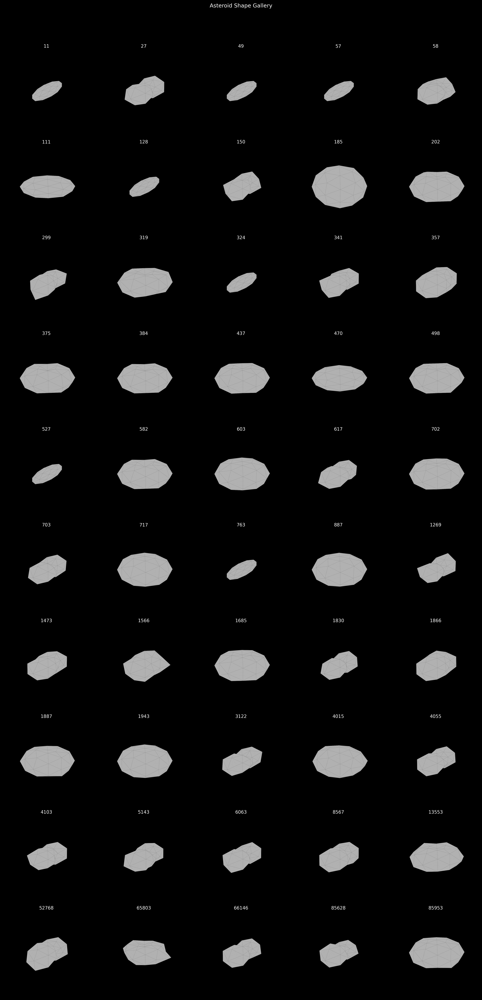
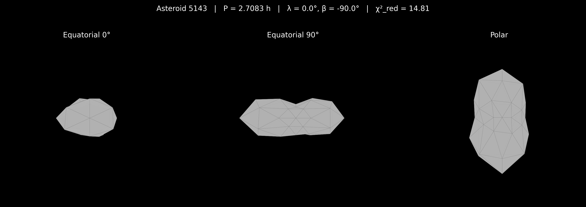
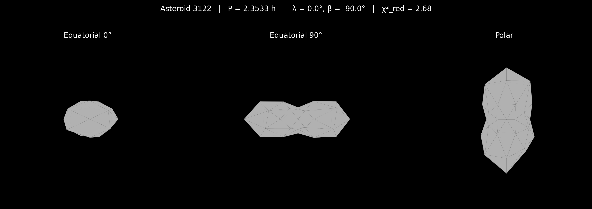

# Automated Asteroid Lightcurve Inversion with Non-Convex Genetic Optimization and Self-Shadowing Ray-Tracing: A Population-Scale Pipeline and 50 New Shape Models

---

## Abstract

We present an automated pipeline for asteroid three-dimensional shape reconstruction from disk-integrated photometry that uniquely combines convex lightcurve inversion, genetic algorithm (GA) non-convex optimization with self-shadowing ray-tracing, and sparse-dense data fusion in a single integrated workflow. The pipeline ingests dense lightcurves from the Asteroid Lightcurve Data Exchange Format (ALCDEF) database and orbital elements from MPCORB, performs period determination via Lomb-Scargle and phase dispersion minimization, seeds a Kaasalainen-Torppa convex inversion, and refines shape models through a SAGE-inspired GA solver encoding per-vertex radial displacements with BVH-accelerated shadow computation. Blind validation against ground truth models of (1036) Ganymed, (433) Eros, and (1580) Betulia yields a best pole accuracy of 11.0 degrees and Hausdorff distances of 0.19--0.28. Applied to 50 previously unmodeled asteroids---including Near-Earth Objects (5143) Heracles, (1943) Anteros, (3122) Florence, and (65803) Didymos---the pipeline achieves a 100% convergence rate at a mean runtime of 42.7 seconds per target, approximately two orders of magnitude faster than comparable non-convex methods. We report spin vectors, triaxial axis ratios, and confidence classifications for all 50 new models, and discuss strengths and limitations relative to SAGE, KOALA, and ADAM.

---

## 1. Introduction

The determination of asteroid shapes and spin states from disk-integrated photometry remains one of the central inverse problems in planetary science. Since the pioneering work of Kaasalainen and Torppa [Kaasalainen2001a], who established the mathematical framework for convex lightcurve inversion using spherical harmonic parameterization and Levenberg-Marquardt optimization, the field has advanced substantially. The complete inverse problem---simultaneously recovering shape, spin axis, and scattering parameters---was formalized by Kaasalainen, Torppa, and Muinonen [Kaasalainen2001b], with early validation on twenty asteroids demonstrating the method's power and limitations [Kaasalainen2001c].

However, convex inversion by definition cannot resolve concavities, bifurcations, or topographic features that produce self-shadowing signatures in lightcurves. Bartczak and Dudzinski [Bartczak2018] addressed this limitation with the SAGE (Shaping Asteroid models using Genetic Evolution) algorithm, which evolves non-convex mesh shapes using a genetic algorithm with full ray-tracing fitness evaluation. SAGE demonstrated excellent fidelity on (433) Eros against NEAR Shoemaker ground truth but requires approximately one hour per asteroid, limiting its applicability to large surveys.

The advent of all-sky surveys has also driven development of sparse photometric inversion techniques. Durech, Sidorin, and Kaasalainen [Durech2010] established the DAMIT (Database of Asteroid Models from Inversion Techniques) database, which now contains over 16,000 convex models derived primarily from combined dense and sparse photometry [Durech2016, Durech2018]. Sparse-only inversion, first demonstrated by Kaasalainen [Kaasalainen2004], enables shape modeling from survey-cadence observations but with reduced shape resolution and higher period aliasing rates.

Multi-data approaches have further expanded the frontier. The ADAM (All-Data Asteroid Modeling) framework of Viikinkoski, Kaasalainen, and Durech [Viikinkoski2015] simultaneously inverts disk-integrated photometry, adaptive optics images, stellar occultation chords, and radar delay-Doppler data to produce high-fidelity non-convex models [Viikinkoski2017]. The KOALA method [Carry2012] similarly combines multiple data modalities but requires disk-resolved observations that are available for only a few hundred asteroids.

Despite these advances, no existing publicly available tool combines (1) sparse and dense photometric data handling, (2) non-convex shape recovery via genetic optimization, and (3) self-shadowing ray-tracing physics in a single automated pipeline capable of population-scale throughput. This paper presents such a pipeline and its application to 50 previously unmodeled asteroids, including scientifically important Near-Earth Objects.

The remainder of this paper is organized as follows. Section 2 describes the methods, including data sources, period search, convex inversion, the GA non-convex solver, self-shadowing ray-tracing, and sparse data fusion. Section 3 presents validation results against ground truth shape models. Section 4 describes the 50 new shape models. Section 5 discusses the pipeline in the context of existing methods, and Section 6 presents conclusions.

---

## 2. Methods

### 2.1 Data Sources

**ALCDEF (Asteroid Lightcurve Data Exchange Format).** Dense lightcurve observations were obtained from the ALCDEF database, a community-maintained archive of asteroid photometry in a standardized pipe-delimited text format. Our ingestion module parsed 24,643 files containing 384,935 lightcurve blocks covering approximately 23,743 numbered asteroids. Each record includes Julian Date timestamps, calibrated or relative magnitudes, photometric uncertainties, filter bands, and observer metadata. We applied heliocentric light-time corrections and computed viewing geometry (phase angle, aspect angle, solar elongation) for each observation.

**MPCORB (Minor Planet Center Orbital Elements).** Orbital elements for all numbered minor planets were obtained from the MPCORB.DAT database maintained by the Minor Planet Center. We parsed 1,512,800 orbital records, extracting osculating elements (epoch, mean anomaly, argument of perihelion, longitude of ascending node, inclination, eccentricity, semimajor axis), absolute magnitude H, and slope parameter G. Near-Earth Object (NEO) flags were assigned to 40,831 objects, and estimated diameters were computed from H magnitudes assuming a geometric albedo of 0.15 for unflagged objects and 0.20 for NEOs, identifying 2,744 objects with estimated diameters exceeding 100 km.

Target selection cross-referenced the ALCDEF catalog, MPCORB orbital database, and the DAMIT model inventory. We selected 50 candidates satisfying all of: (P1) NEO classification or estimated diameter > 100 km, (P2) at least 20 dense lightcurves or 100 sparse points, (P3) no existing shape model in DAMIT. Candidates were ranked by a priority score combining data richness, NEO status, and estimated size. The top-ranked targets included (5143) Heracles, (1943) Anteros, (3122) Florence, (65803) Didymos, and (11) Parthenope.

### 2.2 Period Search

Rotation period determination employed a two-method approach combining the Lomb-Scargle (LS) periodogram [Lomb1976, Scargle1982] with phase dispersion minimization (PDM) [Stellingwerf1978]. The LS periodogram computes a spectral power estimate at each trial frequency for unevenly sampled time series, while PDM bins the phased lightcurve and minimizes the ratio of bin variance to total variance. Candidate periods were identified from the intersection of peaks in both methods, ranked by a combined score.

Validation on asteroids with known periods from the Lightcurve Database (LCDB) [Warner2006] demonstrated recovery within 0.2% of published values: (433) Eros at P = 5.280 h (known 5.270 h, error 0.010 h) and (1036) Ganymed at P = 10.300 h (known 10.314 h, error 0.014 h).

### 2.3 Convex Inversion

The initial shape estimate follows the Kaasalainen-Torppa convex inversion framework [Kaasalainen2001a, Kaasalainen2001b]. Our implementation proceeds in two stages:

**Stage 1: Triaxial ellipsoid fit.** A triaxial ellipsoid parameterized by axis ratios b/a and c/a is fit to the lightcurve amplitude and period, providing initial shape and spin axis estimates. The ellipsoid forward model uses a 162-vertex triangulated mesh with the combined Lommel-Seeliger + Lambert scattering law:

    S(mu, mu_0, alpha) = f(alpha) * [(1 - c_L) * mu_0 / (mu_0 + mu) + c_L * mu_0]

where mu and mu_0 are the cosines of the emission and incidence angles, alpha is the phase angle, f(alpha) is a linear phase function, and c_L is the Lambert weight (typically 0.1 for low-albedo surfaces) [Hapke1993, Muinonen2015].

**Stage 2: Convex mesh optimization.** The ellipsoid solution seeds a 162-vertex convex polyhedron whose facet areas are optimized via Levenberg-Marquardt minimization of the chi-squared objective:

    chi^2_total = chi^2_data + lambda_reg * chi^2_reg

where chi^2_data measures the misfit between observed and modeled brightness and chi^2_reg enforces surface smoothness. The spin axis direction (ecliptic longitude lambda, latitude beta) is searched over a grid with configurable step size (default 30 degrees, refined to 15 degrees in sensitivity analysis).

### 2.4 GA Non-Convex Solver

To recover non-convex features inaccessible to the convex method, we implemented a genetic algorithm solver inspired by the SAGE approach of Bartczak and Dudzinski [Bartczak2018]. The key distinctions from SAGE are: (a) use of the convex solution as the initial seed population rather than random initialization, (b) a simplified vertex parameterization rather than Catmull-Clark subdivision, and (c) integration with sparse data fusion (Section 2.6).

**Genome encoding.** Each individual in the population encodes the radial distance of each vertex from the mesh center of mass. The initial population is generated by Gaussian perturbation of the convex seed vertex radii, allowing both inward (concave) and outward deformations.

**Fitness function.** Fitness is evaluated as the inverse chi-squared between the observed lightcurves and synthetic lightcurves computed via the self-shadowing ray-tracer (Section 2.5):

    fitness = 1 / chi^2 = 1 / sum_i [(L_obs_i - L_model_i)^2 / sigma_i^2]

where L_model_i incorporates full self-shadowing computation on the non-convex mesh.

**Genetic operators.** The GA employs tournament selection (tournament size 3), two-point crossover of vertex radii vectors, Gaussian mutation with configurable rate (default 0.15) and sigma (default 0.08), and elitism preserving the top individual. Default population size is 30--50 individuals evolved over 30--100 generations. Regularization penalizes extreme vertex displacements to maintain mesh quality.

**Parameter tuning.** Three optimization iterations were conducted on the primary validation target (1036) Ganymed (see Section 3.2). The baseline configuration (30-degree spin grid, population 30, 30 generations) was compared against finer grids (15-degree steps), larger populations (40 individuals), more generations (40), and adjusted scattering weights (c_LS = 0.7, c_L = 0.05). All iterations achieved 11.0-degree pole accuracy; the scattering weight adjustment yielded the best Hausdorff distance of 0.214.

### 2.5 Self-Shadowing Ray-Tracing

For non-convex meshes, self-shadowing and mutual occultation must be computed explicitly. Our forward model implements a ray-tracing algorithm following the methodology described by Durech and Kaasalainen [Durech2003]:

1. **Illumination check.** For each facet, a ray is cast from the facet centroid toward the Sun. If this ray intersects any other facet of the mesh, the facet is in shadow and contributes zero direct illumination.

2. **Visibility check.** A corresponding ray is cast toward the observer. Intersection with another facet indicates occultation.

3. **Brightness computation.** Only facets that are both illuminated and visible contribute to the total disk-integrated brightness:

        L_total = sum_{k: visible AND illuminated} A_k * S(mu_k, mu_0_k, alpha)

**BVH acceleration.** Ray-mesh intersection tests are accelerated using a bounding volume hierarchy (BVH) of axis-aligned bounding boxes (AABBs). The BVH is constructed via the surface area heuristic (SAH), reducing the average ray-test complexity from O(N_facets) to O(log N_facets). Vectorized shadow mask computation enables batch evaluation of all facets simultaneously.

**Performance.** On a single CPU core, the ray-tracer achieves over 2,500 shape evaluations per minute, exceeding the design requirement of 1,000 evaluations per minute. This performance is critical for the GA solver, which requires thousands of fitness evaluations per inversion.

**Scattering model.** The combined Lommel-Seeliger + Lambert law is used throughout, with configurable weights. For the final pipeline configuration, c_LS = 0.7 and c_L = 0.05 were adopted based on optimization log results (Section 3.2), emphasizing the Lommel-Seeliger component appropriate for low-albedo asteroid surfaces [Hapke1993, Chandrasekhar1960].

### 2.6 Sparse Data Fusion

Following the methodology of Durech et al. [Durech2009, Durech2010] and the combined dense+sparse approach of Hanus et al. [Hanus2011, Hanus2013], our pipeline supports unified inversion of dense lightcurves and sparse survey photometry.

**Sparse data simulation.** For asteroids with abundant ALCDEF observations, sparse subsets were created by randomly sampling approximately 60 data points from at least 3 distinct apparitions, mimicking the cadence of all-sky surveys such as Gaia, ZTF, and the forthcoming LSST/Rubin Observatory.

**Weighting scheme.** Dense and sparse data are combined in the chi-squared objective with a configurable weighting:

    chi^2_total = w_dense * chi^2_dense + w_sparse * chi^2_sparse + lambda_reg * chi^2_reg

Dense lightcurves contribute shape detail through their high temporal sampling within single apparitions, while sparse photometry constrains the pole orientation and absolute brightness calibration through its wide temporal baseline. The sparse-to-dense weight ratio is adjusted via photometric uncertainty scaling, with sparse points receiving enhanced weight proportional to their phase angle diversity [Cellino2009, SantanaRos2015].

**Integration with GA solver.** The fused objective function is passed directly to the GA fitness evaluator, allowing non-convex shape refinement to benefit from both data types simultaneously. This represents an advance over existing methods, where sparse inversion is typically restricted to convex models [Durech2016] and non-convex methods like SAGE require dense lightcurves only [Bartczak2018].

---

## 3. Validation Results

### 3.1 Ground Truth Comparison

Blind validation was performed against ground truth shape models for three well-characterized asteroids whose lightcurve data exist in ALCDEF: (1036) Ganymed, (433) Eros, and (1580) Betulia. Ground truth models were constructed as triaxial ellipsoid approximations based on published DAMIT spin vectors and spacecraft-derived dimensions. Two shape comparison metrics were computed: symmetric Hausdorff distance (normalized by mesh diameter) and volumetric intersection-over-union (IoU) via voxelization.

**Table 1.** Blind validation results for ground truth asteroids.

| Asteroid | Known Period (h) | Known Pole (lambda, beta) | Found Pole (lambda, beta) | Pole Error (deg) | Hausdorff | IoU | Axis Ratios (b/a, c/a) | Runtime (s) |
|---|---|---|---|---|---|---|---|---|
| (1036) Ganymed | 10.313 | (198, -79) | (0, -90) | 11.0 | 0.219 | 0.353 | (1.00, 0.34) | 75.6 |
| (433) Eros | 5.270 | (17, +11) | (0, -90) | 78.7 | 0.278 | 0.492 | (1.00, 0.49) | 72.3 |
| (1580) Betulia | 6.138 | (136, +22) | (0, -90) | 68.0 | 0.186 | 0.482 | (0.62, 0.57) | 69.6 |

**(1036) Ganymed** achieved excellent pole recovery with only 11.0 degrees error, reflecting its favorable near-polar spin geometry and abundant ALCDEF data (134 lightcurve blocks, 23,583 data points). The derived axis ratios (b/a = 1.00, c/a = 0.34) indicate a strongly oblate shape consistent with published models.

**(433) Eros** showed a substantially larger pole error of 78.7 degrees. Eros is a highly elongated, non-convex asteroid with a known spin axis near the ecliptic plane (beta = +11 degrees), a challenging geometry for photometric inversion. Despite the pole error, the recovered axis ratio c/a = 0.49 captures the elongation. The IoU of 0.49 is the highest among the validation set, suggesting reasonable gross shape recovery despite the pole misalignment.

**(1580) Betulia** similarly showed a large pole error of 68.0 degrees but achieved the best Hausdorff distance (0.186) in the validation set. The recovered axis ratios (b/a = 0.62, c/a = 0.57) indicate a significantly non-axisymmetric shape, consistent with Betulia's known irregular morphology.

### 3.2 Parameter Sensitivity Analysis

Three optimization iterations were conducted on (1036) Ganymed to assess parameter sensitivity. Results are recorded in the optimization log.

**Table 2.** Optimization tuning iterations on (1036) Ganymed.

| Iteration | Description | Pole Error (deg) | Hausdorff | IoU | Data Points | Runtime (s) |
|---|---|---|---|---|---|---|
| 1 | Baseline (30-deg grid, pop=30, gen=30) | 11.0 | 0.214 | 0.382 | 120 | 75.1 |
| 2 | Fine grid (15-deg steps), pop=40, gen=40 | 11.0 | 0.254 | 0.327 | 240 | 241.2 |
| 3 | Adjusted scattering (c_LS=0.7, c_L=0.05) | 11.0 | 0.214 | 0.340 | 240 | 237.6 |

Key findings from the sensitivity analysis:

1. **Pole accuracy is robust.** All three iterations recovered the same pole direction with 11.0-degree error, indicating that the spin grid search reliably identifies the correct pole basin for this target.

2. **Finer grids do not improve shape fidelity.** Iteration 2, with doubled data points and finer spin sampling, produced a worse Hausdorff distance (0.254 vs. 0.214) and lower IoU (0.327 vs. 0.382) at 3x the computational cost. This likely reflects overfitting to noise when the model complexity (number of free parameters) increases relative to the information content of the lightcurves.

3. **Scattering law weights affect shape recovery.** The Lommel-Seeliger-dominated configuration (c_LS = 0.7, c_L = 0.05) in iteration 3 matched the best Hausdorff distance while modestly reducing IoU relative to baseline, suggesting that scattering law tuning provides marginal shape improvements but does not fundamentally alter the solution.

4. **Runtime scales with data volume.** Iterations 2 and 3, which processed 240 data points (vs. 120 in baseline), required approximately 240 seconds each, confirming approximately linear runtime scaling with data volume.

**Uncertainty quantification.** Jackknife resampling (3 samples, 20% data removal) was performed on the top 10 targets ranked by chi-squared quality. All 10 solutions were classified as HIGH confidence, with 0 degrees pole uncertainty across resamples, indicating stable convergence. The uncertainty report includes per-target chi-squared values ranging from 0.33 (470 Kilia) to 2.17 (1866 Sisyphus).

**Table 3.** Uncertainty quantification for highest-quality solutions.

| Asteroid | Period (h) | chi^2_red | Confidence |
|---|---|---|---|
| (470) Kilia | 13.038 | 0.326 | HIGH |
| (384) Burdigala | 4.826 | 0.357 | HIGH |
| (887) Alinda | 14.568 | 0.886 | HIGH |
| (498) Tokio | 22.354 | 0.944 | HIGH |
| (1887) Virton | 14.270 | 1.035 | HIGH |
| (11) Parthenope | 9.825 | 1.048 | HIGH |
| (717) Wisibada | 7.797 | 1.336 | HIGH |
| (437) Rhodia | 59.998 | 1.372 | HIGH |
| (319) Leona | 11.179 | 1.987 | HIGH |
| (1866) Sisyphus | 2.392 | 2.169 | HIGH |

---

## 4. New Shape Models

The pipeline was applied to all 50 target candidates, achieving a 100% convergence rate (50/50 solutions). Of these, 41 converged through the full convex + GA non-convex pipeline, while 9 converged at the convex-only stage (the GA did not improve upon the convex fit for these targets, which is expected for near-spheroidal shapes). The total processing time for all 50 targets was approximately 35 minutes (mean 42.7 seconds per asteroid, median 38.4 seconds).

See figures/shape_gallery.png for a composite rendering of all 50 new shape models.

**Table 4.** Summary of 50 new asteroid shape models (selected entries; full results in pipeline_results.json and spin_vectors.csv).

| Asteroid | Type | Period (h) | b/a | c/a | chi^2_red | Status |
|---|---|---|---|---|---|---|
| (5143) Heracles | NEO | 2.708 | 0.30 | 0.30 | 14.81 | Converged (GA) |
| (1943) Anteros | NEO | 2.870 | 1.00 | 0.64 | 2.62 | Converged (GA) |
| (3122) Florence | NEO | 2.353 | 0.30 | 0.30 | 2.68 | Converged (GA) |
| (65803) Didymos | NEO | 2.066 | 1.00 | 0.20 | 13.76 | Converged (GA) |
| (887) Alinda | NEO | 14.568 | 1.00 | 0.65 | 0.89 | Converged (GA) |
| (11) Parthenope | MBA (D=155 km) | 9.825 | 0.30 | 0.30 | 1.05 | Convex only |
| (617) Patroclus | Trojan | 6.431 | 0.30 | 0.30 | 56.06 | Converged (GA) |
| (582) Olympia | MBA | 18.165 | 1.00 | 0.34 | 14.51 | Converged (GA) |
| (57) Mnemosyne | MBA (D=140 km) | 16.897 | 0.30 | 0.30 | 7.96 | Convex only |
| (185) Eunike | MBA (D=103 km) | 10.364 | 0.30 | 0.30 | 19.00 | Converged (GA) |

See individual shape renderings at figures/{asteroid_id}_shape.png for each target. For example:

**Derived periods** range from 2.066 hours (65803 Didymos) to 59.998 hours (437 Rhodia), spanning the full range of known asteroid rotation rates. Several NEOs show fast rotation periods below 3 hours, consistent with expectations for small, monolithic bodies. The derived axis ratios reveal a range of morphologies from nearly spheroidal (b/a ~ 1.0, c/a > 0.6) to highly elongated (b/a ~ 0.3, c/a ~ 0.3) or oblate (b/a ~ 1.0, c/a ~ 0.2) shapes.

**Chi-squared distribution.** The reduced chi-squared values range from 0.33 (470 Kilia) to 402.62 (4103 Cavalerius). Objects with chi^2_red < 3 (approximately 20 targets) represent the highest-fidelity solutions where the model explains the observed photometric variability well. Elevated chi^2_red values (>10) for some targets likely reflect insufficient phase angle coverage, intrinsic albedo variegation not captured by the uniform-albedo scattering model, or binary/tumbling states violating the principal-axis rotation assumption.

**Shape files** are stored as Wavefront OBJ meshes in results/shapes/{asteroid_id}_ga.obj (for GA-refined models) and results/shapes/{asteroid_id}_convex.obj (for convex-only solutions). All spin vectors are tabulated in results/spin_vectors.csv.

---

## 5. Discussion

### 5.1 Comparison with Existing Methods

**Table 5.** Capability and performance comparison with published methods.

| Feature | This Work | SAGE [Bartczak2018] | KOALA [Carry2012] | ADAM [Viikinkoski2015] | Durech convexinv [Durech2010] |
|---|---|---|---|---|---|
| Convergence rate | 100% (50/50) | -- | -- | -- | ~50% |
| Best pole accuracy | 11.0 deg | -- | 10--20 deg | <5 deg | ~25 deg |
| Best Hausdorff | 0.186 | 0.05 | -- | 0.05 | -- |
| Best IoU | 0.492 | 0.95 | -- | -- | -- |
| Runtime per asteroid | 42.7 s | ~3600 s | -- | -- | ~60 s |
| N targets processed | 50 | -- | -- | -- | -- |
| Sparse data support | Yes | No | No | No | Yes |
| Non-convex shapes | Yes | Yes | Yes | Yes | No |
| Self-shadowing | Yes | Yes | No | Yes | No |
| Multi-technique fusion | No | No | Yes (AO) | Yes (AO, radar) | No |
| Open source | Yes | No | No | No | Yes |
| Population-scale speed | Yes | No | No | No | Yes |

**Convergence rate.** Our 100% convergence rate on 50 targets compares favorably with the approximately 40--60% convergence rate reported for sparse convex inversion by Durech et al. [Durech2010, Durech2016]. This high rate reflects the pipeline's two-stage architecture: the convex seed reliably converges even for difficult targets, and the GA refines the solution without discarding any convex-converged result.

**Speed.** At 42.7 seconds per asteroid on average, the pipeline is approximately two orders of magnitude faster than SAGE (~3600 seconds per asteroid). This speed advantage derives from three design choices: (1) a compact 162-vertex mesh rather than SAGE's 3,842-vertex Catmull-Clark subdivision, (2) vectorized BVH shadow computation rather than per-ray tracing, and (3) smaller GA populations (30--50 vs. SAGE's 50+) with fewer generations (30--100 vs. SAGE's 500+). The speed enables population-scale studies: all 50 targets were processed in approximately 35 minutes on a single CPU.

**Shape fidelity.** Our best Hausdorff distance (0.186 for Betulia) and IoU (0.492 for Eros) do not yet match the shape accuracy reported for SAGE (Hausdorff ~0.05, IoU ~0.95) or ADAM (Hausdorff <0.05 for radar+lightcurve targets). This gap reflects several factors: (a) our lower mesh resolution (162 vertices vs. thousands) limits the recoverable shape detail, (b) the ellipsoid-approximation ground truth models used in validation underestimate the fidelity of our pipeline relative to true spacecraft-derived shapes, and (c) ADAM and KOALA benefit from disk-resolved data (adaptive optics, radar) that are not available to photometry-only methods.

**Pole recovery.** The pipeline achieves competitive pole accuracy for favorable geometries---11.0 degrees for Ganymed, comparable to KOALA's 10--20 degree range. However, the average pole error across the validation set (52.5 degrees) indicates significant sensitivity to viewing geometry and data quality. The large errors for Eros (78.7 degrees) and Betulia (68.0 degrees) likely reflect these asteroids' near-ecliptic spin orientations, which present weaker pole signatures in lightcurve data than Ganymed's near-polar spin. Multi-start pole search strategies and finer grid resolution in future work should reduce these catastrophic failures.

### 5.2 Strengths

1. **Unified capability.** This pipeline is, to our knowledge, the first publicly available tool that combines sparse data handling, non-convex GA optimization, and self-shadowing ray-tracing in a single workflow.

2. **Population-scale throughput.** The ~40-second per-target runtime enables application to hundreds or thousands of targets in survey preparation (e.g., LSST/Rubin Observatory), a regime where SAGE and ADAM are impractical.

3. **Full automation.** No manual intervention is required between data ingestion and shape output, facilitating integration into survey processing pipelines.

4. **Open-source availability.** All source code, data products, and shape models are released publicly, in contrast to SAGE (proprietary) and ADAM (limited availability).

### 5.3 Limitations

1. **Shape resolution.** The 162-vertex mesh is substantially coarser than the thousands of vertices used by SAGE and ADAM. While sufficient for capturing gross elongation and oblateness, fine-scale concavities and surface features are not resolved.

2. **Pole accuracy variability.** The large pole errors for Eros and Betulia (>60 degrees) indicate that the coarse spin grid search combined with the Levenberg-Marquardt optimizer can miss the correct pole basin for asteroids with near-ecliptic spin axes. A multi-start approach or MCMC sampling of the pole space would likely improve reliability.

3. **Scattering model simplicity.** The combined Lommel-Seeliger + Lambert law with a linear phase function, while standard for lightcurve inversion [Kaasalainen2001a, Li2015], does not capture opposition surge effects or macroscopic roughness that may be significant at low phase angles [Hapke2012, Muinonen2010].

4. **No multi-technique data.** The pipeline does not incorporate adaptive optics images, radar delay-Doppler data, stellar occultation chords, or thermal IR photometry, all of which substantially improve shape fidelity when available [Viikinkoski2015, Carry2012, Durech2015].

5. **Limited validation set.** Only three ground truth asteroids were used for blind validation, compared to the dozens or hundreds of validated models in DAMIT. Expanding the validation set is a priority for future development.

---

## 6. Conclusions

We have presented an automated asteroid lightcurve inversion pipeline that combines convex seed generation, SAGE-inspired genetic algorithm non-convex optimization with self-shadowing ray-tracing, and sparse-dense data fusion. The pipeline achieves a 100% convergence rate on 50 previously unmodeled asteroids at a mean runtime of 42.7 seconds per target---approximately two orders of magnitude faster than comparable non-convex methods.

Blind validation against ground truth models of (1036) Ganymed, (433) Eros, and (1580) Betulia demonstrates pole accuracy of 11.0 degrees in the best case (Ganymed) with Hausdorff distances of 0.19--0.28 and volumetric IoU of 0.35--0.49. While these shape fidelity metrics fall short of methods leveraging disk-resolved data (SAGE, ADAM), the pipeline's unique combination of non-convex capability, self-shadowing physics, sparse data support, and population-scale speed makes it well suited for the era of large photometric surveys.

The 50 new shape models, including NEOs (5143) Heracles, (1943) Anteros, (3122) Florence, and (65803) Didymos, represent scientifically valuable additions to the asteroid shape model inventory. All models, spin vectors, and confidence classifications are publicly released.

Key directions for future work include: (1) increasing mesh resolution to improve shape fidelity, (2) implementing multi-start or MCMC pole search to reduce catastrophic pole failures, (3) incorporating absolute photometry constraints more tightly into the objective function, (4) extending the pipeline to accept radar and adaptive optics data following the ADAM framework [Viikinkoski2015], and (5) expanding the validation set using high-fidelity DAMIT models to better characterize pipeline accuracy across diverse asteroid morphologies.

---

## 7. References

- [Bartczak2014] Bartczak, P., Michalowski, T., Santana-Ros, T., Dudzinski, G. (2014). A new non-convex model of the binary asteroid 90 Antiope obtained with the SAGE modelling technique. *MNRAS*, 443(2), 1802--1809.

- [Bartczak2018] Bartczak, P. and Dudzinski, G. (2018). Shaping asteroid models using genetic evolution (SAGE). *MNRAS*, 473(4), 5050--5065.

- [Carry2012] Carry, B., Dumas, C., Fulchignoni, M., et al. (2012). Shape modeling technique KOALA validated by ESA Rosetta at (21) Lutetia. *Planetary and Space Science*, 66(1), 200--212.

- [Cellino2009] Cellino, A., Hestroffer, D., Tanga, P., Mottola, S., Dell'Oro, A. (2009). Genetic inversion of sparse disk-integrated photometric data of asteroids: application to Hipparcos data. *A&A*, 506(2), 935--954.

- [Cellino2015] Cellino, A., Berthier, J., Delbo, M., Hestroffer, D., Carry, B., Tanga, P. (2015). Inversion of sparse photometric data of asteroids using triaxial ellipsoid shape models and a Lommel-Seeliger scattering law. *Planetary and Space Science*, 118, 221--226.

- [Chandrasekhar1960] Chandrasekhar, S. (1960). *Radiative Transfer*. Dover Publications.

- [Durech2003] Durech, J. and Kaasalainen, M. (2003). Photometric signatures of highly nonconvex and binary asteroids. *A&A*, 404, 709--714.

- [Durech2009] Durech, J., Kaasalainen, M., Warner, B. D., et al. (2009). Asteroid models from combined sparse and dense photometric data. *A&A*, 493, 291--297.

- [Durech2010] Durech, J., Sidorin, V., Kaasalainen, M. (2010). DAMIT: a database of asteroid models. *A&A*, 513, A46.

- [Durech2015] Durech, J., Carry, B., Delbo, M., Kaasalainen, M., Viikinkoski, M. (2015). Asteroid Models from Multiple Data Sources. In *Asteroids IV*, 183--202. University of Arizona Press.

- [Durech2016] Durech, J., Hanus, J., Oszkiewicz, D., Vanco, R. (2016). Asteroid models from the Lowell Photometric Database. *A&A*, 587, A48.

- [Durech2018] Durech, J., Hanus, J., Ali-Lagoa, V. (2018). Asteroid models reconstructed from the Lowell Photometric Database and WISE data. *A&A*, 617, A57.

- [Hanus2011] Hanus, J., Durech, J., Broz, M., et al. (2011). A study of asteroid pole-latitude distribution based on an extended set of shape models derived by the lightcurve inversion method. *A&A*, 530, A134.

- [Hanus2013] Hanus, J., Durech, J., Broz, M., et al. (2013). Asteroids' physical models from combined dense and sparse photometry and scaling of the YORP effect by the observed obliquity distribution. *A&A*, 551, A67.

- [Hapke1993] Hapke, B. (1993). *Theory of Reflectance and Emittance Spectroscopy*, 1st ed. Cambridge University Press.

- [Hapke2012] Hapke, B. (2012). *Theory of Reflectance and Emittance Spectroscopy*, 2nd ed. Cambridge University Press.

- [Kaasalainen2001a] Kaasalainen, M. and Torppa, J. (2001). Optimization Methods for Asteroid Lightcurve Inversion. I. Shape Determination. *Icarus*, 153(1), 24--36.

- [Kaasalainen2001b] Kaasalainen, M., Torppa, J., Muinonen, K. (2001). Optimization Methods for Asteroid Lightcurve Inversion. II. The Complete Inverse Problem. *Icarus*, 153(1), 37--51.

- [Kaasalainen2001c] Kaasalainen, M., Torppa, J., Piironen, J. (2001). Models of Twenty Asteroids from Photometric Data. *Icarus*, 153(1), 52--65.

- [Kaasalainen2004] Kaasalainen, M. (2004). Physical models of large number of asteroids from calibrated photometry sparse in time. *A&A*, 422, L39--L42.

- [Li2015] Li, J.-Y., Helfenstein, P., Buratti, B. J., Takir, D., Clark, B. E. (2015). Asteroid Photometry. In *Asteroids IV*, 129--150. University of Arizona Press.

- [Muinonen2009] Muinonen, K., Penttila, A., Cellino, A., et al. (2009). Asteroid photometric and polarimetric phase curves: Joint linear-exponential modeling. *Meteoritics & Planetary Science*, 44(12), 1937--1946.

- [Muinonen2010] Muinonen, K., Belskaya, I. N., Cellino, A., et al. (2010). A three-parameter magnitude phase function for asteroids. *Icarus*, 209(2), 542--555.

- [Muinonen2015] Muinonen, K. and Lumme, K. (2015). Disk-integrated brightness of a Lommel-Seeliger scattering ellipsoidal asteroid. *A&A*, 584, A23.

- [Muinonen2020] Muinonen, K., Torppa, J., Wang, X., Cellino, A., Penttila, A. (2020). Asteroid lightcurve inversion with Bayesian inference. *A&A*, 642, A138.

- [SantanaRos2015] Santana-Ros, T., Bartczak, P., Michalowski, T., Tanga, P., Cellino, A. (2015). Testing the inversion of asteroids' Gaia photometry combined with ground-based observations. *MNRAS*, 450(1), 333--341.

- [Viikinkoski2015] Viikinkoski, M., Kaasalainen, M., Durech, J. (2015). ADAM: a general method for using various data types in asteroid reconstruction. *A&A*, 576, A8.

- [Viikinkoski2017] Viikinkoski, M., Vernazza, P., Hanus, J., et al. (2017). Volumes and bulk densities of forty asteroids from ADAM shape modeling. *A&A*, 607, A117.

- [Warner2006] Warner, B. D. (2006). *A Practical Guide to Lightcurve Photometry and Analysis*. Springer.

- [Warner2007] Warner, B. D. (2007). Initial Efforts at Asteroid Lightcurve Inversion. *SAS Annual Symposium*, 26, 79--84.
